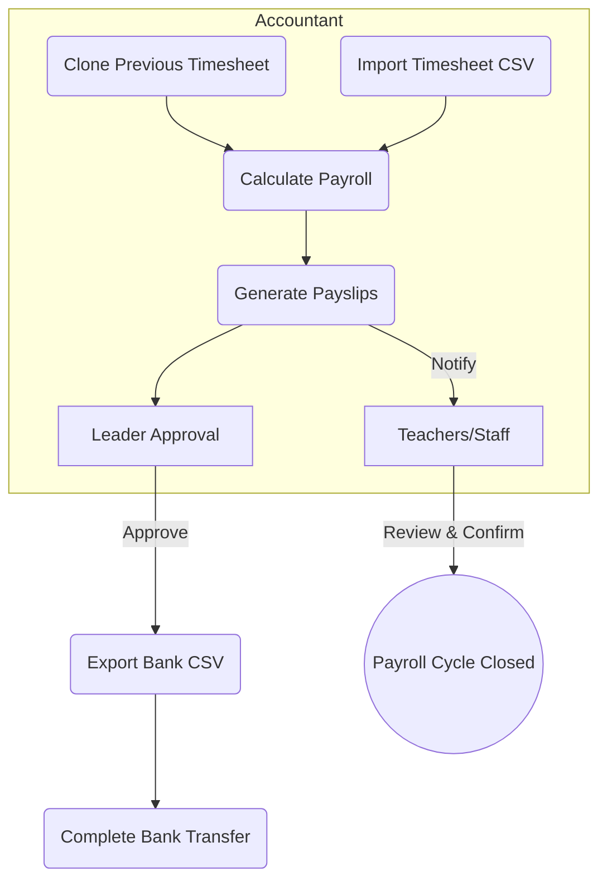

### 1 Vision

Manage kindergarten payroll **in minutes, not hours**, while guaranteeing 100 % accuracy and regulatory compliance.

### 2 Problem Statement

Managers and accountants currently duplicate a Google Sheet each month, perform fragile manual formulas, and trigger bank transfers without payslip confirmation. This leads to data‑entry errors, rework, and a lack of transparency for teachers/staff.

### 3 Goals & Success Metrics

Goal

KPI / Target

**Reduce admin time**

≤ 10 min to process a full pay cycle

**Error reduction**

≤ 0.5 % payroll corrections per cycle

**On‑time payment**

100 % salaries paid by the 28ᵗʰ each month

**Staff transparency**

95 % staff download their payslip each month

### 4 User Roles & User Stories

Role

Epic

User Stories

**Accountant**

Payroll Preparation

- **As an Accountant,** I want to **import the timesheet CSV** so that I can start payroll calculations. - **As an Accountant,** I want to **clone the previous month's timesheet data** so that I can quickly create a new payroll cycle and edit any entries as needed. - **As an Accountant,** I want the system to **auto‑calculate gross, net salary and statutory deductions** so that I don’t have to use complex spreadsheets. - **As an Accountant,** I want to **generate payslips in bulk** so that every teacher receives a PDF link. - **As an Accountant,** I want to **export a bank‑ready CSV** so that I can upload it directly to MB Bank.

**School Leader**

Payroll Approval

- **As a School Leader,** I want to **review the payroll summary dashboard** so that I can quickly validate total cost before approval.- **As a School Leader,** I want to **approve or reject a payroll run** so that incorrect payments are caught early.- **As a School Leader,** I want to **unlock the bank CSV** only after approval so that payments cannot be initiated prematurely.

**Teacher / Staff**

Self‑Service

- **As a Teacher,** I want to **update my personal and bank information** so that my salary goes to the correct account.- **As a Teacher,** I want to **receive and download my payslip on my phone** so that I can verify my salary anytime.- **As a Teacher,** I want to **acknowledge receipt or flag issues** so that discrepancies are addressed before payout.

### 5 Scope (MVP) Scope (MVP)

- Monthly payroll with **mid‑month advance**
- Fixed salary + allowances, deductions, and employer/employee social insurance
- Role‑based access (Accountant, Staff) (Leader role planned for v2)
- Vietnamese UI (English secondary)
- Bank payment file (MBBank CSV) export
- Dashboard: cost summary per **Đơn Vị** (unit/campus)

### 6 Constraints

- Must **run Dockerised** on a local Ubuntu PC (no mandatory cloud)
- GDPR‑like data retention: 5 years min

### 7 Assumptions

- Attendance data is prepared externally (e.g. a timesheet CSV) and imported
- MB Bank supports bulk salary CSV upload

### 8 Out‑of‑Scope (v1)

- Automated tax filing uploads
- Parent invoicing (slated for v2)

### 9 Dependencies

- National Social Insurance API (future)
- Stripe or VNPay (future for tuition)

### 10 Roadmap

Version

Key Features

**v1 – Accountant & Staff**

• Roles: Accountant & Teacher/Staff only (no Leader)• Clone/import timesheets, payroll calculation, payslip generation• Bank CSV export immediately after Accountant confirmation• Clerk auth with two roles (accountant, staff)• Dashboards visible to Accountant

**v2 – Leader Approval**

• Introduce School Leader role• Multi‑step approval flow: Accountant submits → Leader approves → Bank CSV unlocked• Leader dashboards & cost summary• Approval notifications & enhanced audit logs

---

## /docs/AppFlow.md – User Journey & Screens

**Mobile‑friendly flows** (for phone usage):

1.  Teacher opens app → _My Profile_ → updates bank info.
2.  Push notification when payslip is ready → taps to view PDF → confirmation.
